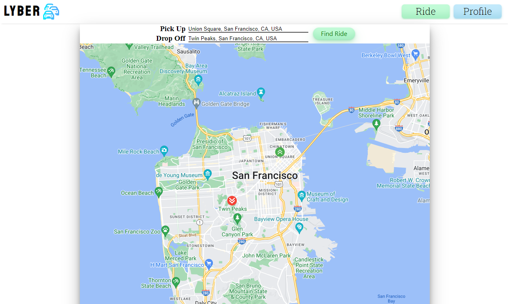

<div id="top"></div>

<!-- PROJECT LOGO -->
<br />
<div align="center">
  <!-- <a href="https://github.com/suwanshree/lyber"> -->
    
  </a>

<h2 align="center">LYBER</h2>

  <p align="center">
    A portfolio clone of ridesharing apps (Lyft / Uber)
    <br />
    <br />
    <a href="https://lyber-rideshare.herokuapp.com/"><strong>Explore the site »</strong></a>
    <br />
    <br />
    <a href="https://github.com/suwanshree/lyber/wiki"><strong>Explore the docs »</strong></a>
    <br />
  </p>
</div>

<!-- TABLE OF CONTENTS -->
<details>
  <summary>Table of Contents</summary>
  <ol>
    <li><a href="#about-the-project">About The Project</a></li>
    <li><a href="#key-features">Key Features</a></li>
    <li><a href="#frontend-overview">Frontend Overview</a></li>
    <li><a href="#backend-overview">Backend Overview</a></li>
    <li><a href="#star-yelp-setup">Star Yelp Setup</a></li>
    <li><a href="#usage">Usage</a></li>
    <li><a href="#future-implementations">Future Implementations</a></li>
    <li><a href="#contact">Contact</a></li>
    <li><a href="#attribution">Attribution</a></li>
  </ol>
</details>

<!-- ABOUT THE PROJECT -->

## About The Project

Lyber, a Lyft / Uber clone, is a full stack ridesharing app for users to input their exact pickup and drop off locations, then find a ride to their destination by getting matched with a nearby driver. Users can view the total cost of the ride, and also go into their profile to see previous rides they have taken through the application. Work on current features is in progress and more features are planned for the future.



## Key Features

- Create new users and have user login with authorization
- Once logged in, search for and add valid pick-up and drop-off addresses
- Request a ride with the addresses filled in using the Find Ride button
- Get a "ride simulation" and view user profile for previous rides

<p align="right">(<a href="#top">back to top</a>)</p>

<!-- BUILT WITH -->

## Frontend Overview

Star Yelp is built on a React frontend and uses an npm package for displaying ratings as stars.

Technologies/Frameworks Used

- [Javascript](https://www.javascript.com)
- [React](https://reactjs.org/)
- [Redux](https://redux.js.org/)
- [HTML](https://developer.mozilla.org/en-US/docs/Web/HTML)
- [CSS](https://developer.mozilla.org/en-US/docs/Web/CSS)
- [react-google-maps-api](https://react-google-maps-api-docs.netlify.app/)

## Backend Overview

Star Yelp uses a Flask backend and utilizes PostgreSQL as its database. It also uses wtfforms as a form package.

Technologies/Frameworks Used

- [Python](https://www.python.org/)
- [PostgreSQL](https://www.postgresql.org/docs/)
- [Flask](https://flask.palletsprojects.com/en/2.1.x/)
- [Wtfforms](https://wtforms.readthedocs.io/)
- [SQLAlchemy](https://www.sqlalchemy.org/)

The live site is hosted on Heroku using github docker containers.

- [Heroku](https://www.heroku.com)

<p align="right">(<a href="#top">back to top</a>)</p>

## Star Yelp Setup

1. Clone the repository from: https://github.com/suwanshree/lyber
2. Install dependencies:

   ```bash
   pipenv install --dev -r dev-requirements.txt && pipenv install -r requirements.txt
   ```

3. Create a **.env** file based on the example with proper settings for your
   development environment.
4. Setup your PostgreSQL user, password and database that matches the **.env** file.
5. Get into your pipenv, migrate your database, seed your database, and run your flask app:

   ```bash
   pipenv shell
   ```

   ```bash
   flask db upgrade
   ```

   ```bash
   flask seed all
   ```

   ```bash
   flask run
   ```

6. To run the React App in development, checkout the [README](./react-app/README.md) inside the `react-app` directory.

<!-- USAGE EXAMPLES -->

## Usage

- Users can signup and login to use Lyber, and can also use the demo feature to explore the app quickly.

- Once logged in, the user is directed to the ride page, where logged-in users can view the map component and enter pick-up and drop-off addresses.

(More features to be implemented soon)

<p align="right">(<a href="#top">back to top</a>)</p>

<!-- FUTURE IMPLEMENTATIONS -->

## Future Implementations

- To Be Decided

<!-- CONTACT -->

## Contact

Suwanshree Acharya - [GitHub](https://github.com/suwanshree)

Project Repo Link: [https://github.com/suwanshree/lyber](https://github.com/suwanshree/lyber)

Project Link: [https://lyber-rideshare.herokuapp.com/](https://lyber-rideshare.herokuapp.com/)

<p align="right">(<a href="#top">back to top</a>)</p>

<!-- ATTRIBUTION -->

## Attribution

Splash page gif:
Organizowanie studniówek Katowice, CC BY-SA 4.0 <https://creativecommons.org/licenses/by-sa/4.0>, via Wikimedia Commons

up arrow png:
<a href="https://www.flaticon.com/free-icons/up-arrow" title="up arrow icons">Up arrow icons created by kliwir art - Flaticon</a>

down arrow png:
<a href="https://www.flaticon.com/free-icons/arrows" title="arrows icons">Arrows icons created by lakonicon - Flaticon</a>
